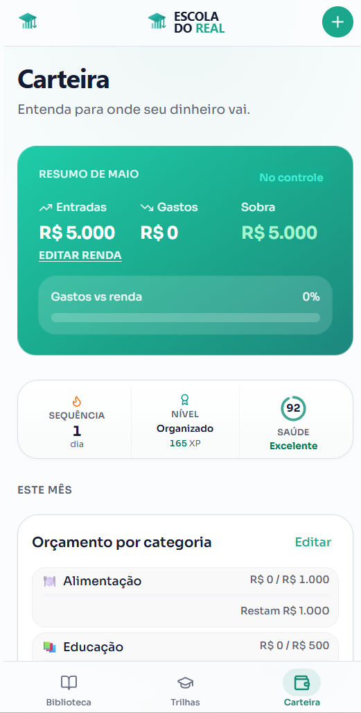
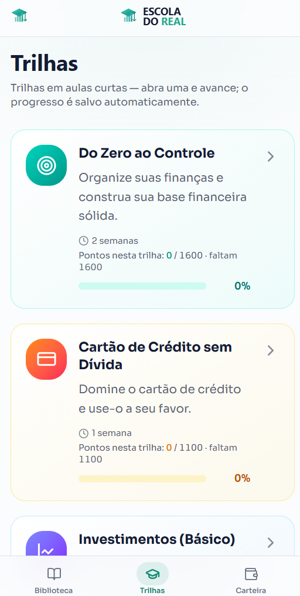
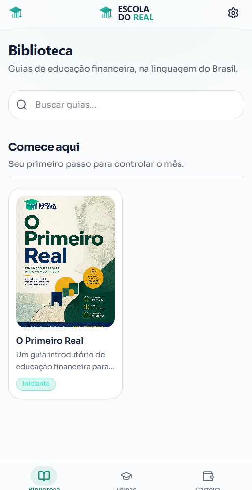
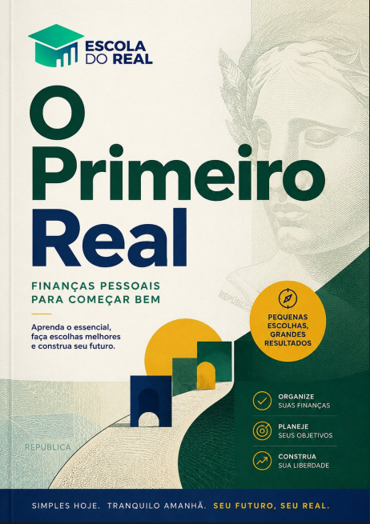

# Escola do Real

Public showcase for a private production app.

[Open the live app](https://escola-do-real--jcarval2.replit.app/cursos)

Escola do Real is a mobile-first financial education app for Brazilians who want to understand money, get organized, and build a healthier relationship with their personal finances.

The complete source code is private. This repository presents the product, the learning material, and the work behind the project without exposing proprietary implementation details.

## Project Overview

I built Escola do Real as a complete education product, not just a software prototype. The project includes the app, the written learning material, and recorded online classes inside the platform.

The app is currently awaiting App Store approval.

## What I Built

- Full mobile-first financial education app
- Private production codebase
- Guided learning paths with short classes
- Personal finance wallet and budget experience
- Library of written financial education guides
- Original book: **O Primeiro Real**
- Recorded online classes available inside the app
- Production deployment workflow
- App Store submission preparation

## Product Areas

### Biblioteca

The Biblioteca section gives users access to written guides and educational material in a clear, approachable language for Brazil.

It includes **O Primeiro Real**, an original beginner-friendly guide written for people taking their first step into financial education.

### Trilhas

The Trilhas section organizes the learning experience into structured paths. Users can move through short lessons, track progress, and build knowledge step by step.

### Carteira

The Carteira section helps users understand where their money goes by tracking income, spending, category budgets, and financial health indicators.

## Original Education Content

This project includes original learning content created for Escola do Real:

- A complete financial education book
- Recorded online classes
- App-based learning paths
- Practical guides for Brazilian users

The goal is to make financial education feel direct, useful, and accessible instead of abstract or intimidating.

## Tech Stack

- React Native / Expo
- TypeScript
- Supabase
- GitHub version control
- Mobile production build tooling
- Replit deployment for the live web preview

## Status

- Live web preview available
- Private production repository maintained separately
- App submitted and awaiting App Store approval
- Public showcase repository available here

## Why The Source Code Is Private

The app contains product-specific implementation details, private configuration, deployment workflows, and business logic that should not be published publicly.

This public repository exists to present the project professionally while keeping the production codebase protected.

## Product Preview

### Carteira

The wallet experience helps users understand income, spending, budgets, and financial health in one place.

### Trilhas

Structured learning paths organize the classes into short, trackable journeys.

### Biblioteca

The library gives users access to written financial education guides, including the original book **O Primeiro Real**.

### O Primeiro Real

**O Primeiro Real** is the original financial education book written for the app.

### Recorded Classes

The app includes recorded online classes created for Escola do Real.

## Owner

Built, written, and recorded by [7thcapitalist](https://github.com/7thcapitalist).
